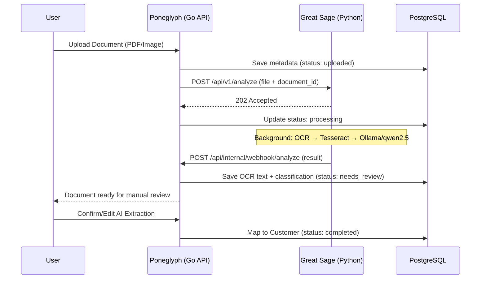

# DocuNest

DocuNest is a private, local-first document organization platform. It automatically scans, reads, classifies, and catalogs documents for individual customers without sending any sensitive data to external cloud services.

Designed for environments where document confidentiality is non-negotiable, DocuNest combines local OCR, on-device AI, and human-in-the-loop review to ensure reliable, zero-leakage records management.

---

## 🚀 How to Run the Application

The easiest way to run the entire stack (Poneglyph + Great Sage) on Windows is using the provided `start.ps1` orchestrator script. 

1. Ensure **PostgreSQL** is running (`docker-compose up -d`)
2. Ensure **Ollama** is running locally
3. Open a PowerShell terminal in this directory and run:
   ```powershell
   .\start.ps1
   ```
4. Access the web app at [http://localhost:8080](http://localhost:8080) (Default login: `admin` / `admin`)
5. In a separate terminal, start Great Sage:
   ```powershell
   cd ..\great-sage
   uvicorn app.main:app --host 127.0.0.1 --port 8000
   ```

---

## Core Capabilities

- **Local OCR**: Extracts text from PDFs and images locally using PyMuPDF and Tesseract. Very fast and lightweight (no heavy PyTorch models required).
- **On-Device AI Classification**: Communicates with local language models via Ollama to determine document categories (Aadhaar, PAN, Passport, Invoice, etc.) and extract customer names.
- **Human-in-the-Loop Review**: Enforces a "Needs Review" state where staff members verify AI extraction before files are committed to customer profiles.
- **Customer Dossiers & In-App Viewer**: Expandable profiles with a secure, embedded document viewer.
- **Data Wiper (Danger Zone)**: Fully authenticated, transactional hard-delete functionality to instantly erase a user's entire footprint (customers, documents, and disk files).

---

## Security & Privacy

DocuNest is built to strict security standards:
- **Authentication**: Argon2id password hashing, strict brute-force protection (IP lockout after 10 failed attempts), and secure HttpOnly cookies.
- **Upload Hardening**: File types are verified via binary MIME inspection. Files are stored using cryptographic UUIDs to prevent path traversal.
- **Multi-Tenant DB Isolation**: Strict `user_id` scoping across all PostgreSQL tables.
- **Audit Logging**: Every AI confirmation and manual file mapping is recorded.

---

## Architecture

DocuNest consists of two independent services:

1. **DocuNest (Poneglyph)**: The core application — Go API server managing sessions, file handling, DB orchestration, users, customers, and human review workflows.
2. **Great Sage**: An independent document intelligence engine responsible for OCR, AI classification, and structured metadata extraction. It runs as a separate Python/FastAPI service.

### System Flow Diagram



### Service Boundaries

| Responsibility | Owner |
|---|---|
| Users, auth, sessions | Poneglyph |
| Customers, PostgreSQL | Poneglyph |
| Document storage, sharing | Poneglyph |
| Human review, audit logs | Poneglyph |
| Frontend | Poneglyph |
| OCR, Tesseract | Great Sage |
| Ollama, qwen2.5 | Great Sage |
| AI classification | Great Sage |
| Structured extraction | Great Sage |

Great Sage has **no direct access** to Poneglyph's database.

### Other Components

- **Frontend**: Single-page app built with Tailwind CSS and Alpine.js (zero build step).
- **Data Layer (PostgreSQL)**: Multi-tenant relational storage.

---

## Quick Start (Windows)

**Prerequisites**: 
- Go 1.21+
- Python 3.10+ 
- PostgreSQL (or Docker)
- Ollama (Ensure the `qwen2.5` model is pulled: `ollama pull qwen2.5`)
- Tesseract OCR (install via `winget install UB-Mannheim.TesseractOCR`)
- Great Sage running on port 8000

**Exact Ready-to-Go Commands**:

1. Start your local PostgreSQL database via Docker:
   ```bash
   docker-compose up -d
   ```
2. Set up and start Great Sage (in a separate terminal):
   ```bash
   cd ..\great-sage
   pip install -r requirements.txt
   uvicorn app.main:app --host 127.0.0.1 --port 8000
   ```
3. Pull the required AI model for Ollama:
   ```bash
   ollama pull qwen2.5
   ```
4. Run the master orchestrator script (starts the Go Backend):
   ```powershell
   .\start.ps1
   ```
5. Open your browser and navigate to `http://localhost:8080`. 
   - **Default Login**: `admin` / `admin` (You should change this in production!)

---

## API Overview

*All protected routes require an authenticated session cookie.*

- **Auth**: `POST /api/login`, `POST /api/logout`
- **Dashboard**: `GET /api/stats`, `POST /api/admin/wipe`
- **Customers**: `GET /api/customers`, `GET /api/customers/{id}/documents`
- **Documents**: `GET /api/documents`, `POST /api/documents/upload`
- **Processing**: `POST /api/documents/{id}/confirm`, `GET /api/documents/{id}/view`
- **Internal**: `POST /api/internal/webhook/analyze` (Great Sage → Poneglyph callback)

---

## Production Deployment

1. **Secrets**: Generate a real `JWT_SECRET` (`openssl rand -base64 32`) and update the `.env` file.
2. **HTTPS**: Terminate TLS via a reverse proxy (Nginx/Caddy) to ensure the `Secure` flag on cookies works properly.
3. **Database SSL**: Set `DB_SSLMODE=require` in your `.env`.
4. **Network**: Keep Ollama and Great Sage bound strictly to `127.0.0.1` or isolated in a private Docker network.
5. **Great Sage**: Must be deployed independently. See the [Great Sage README](../great-sage/README.md) for setup instructions.
