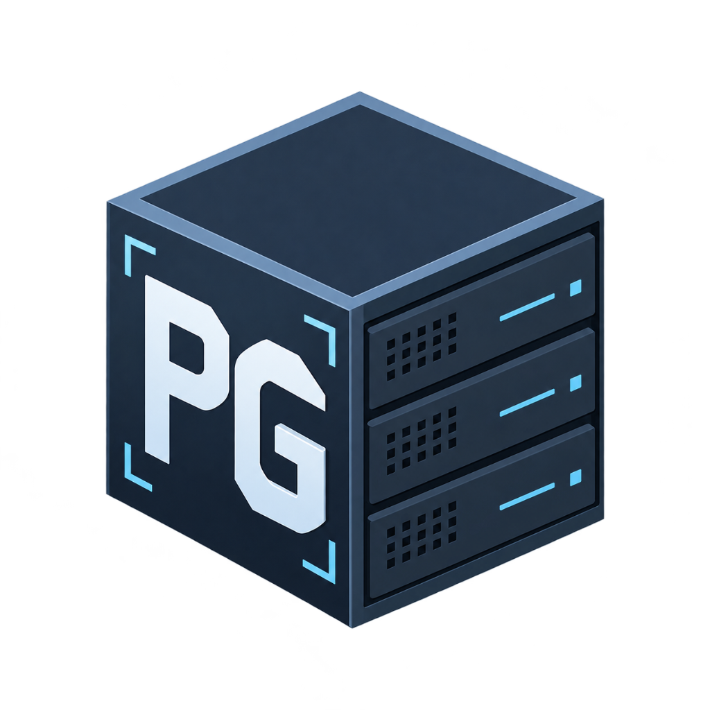

<p align="center">
  
</p>

<h1 align="center">Poneglyph</h1>

<p align="center">
  <strong>High-Speed Batch Document Ingestion Gateway</strong><br>
  <em>Smart • Local • Secure</em>
</p>

<p align="center">
  
  
  
  
  
</p>

Poneglyph is a high-speed batch document ingestion system built with a **Go backend** and a **Vite + React + Tailwind CSS v4 frontend**. It features real-time terminal logging, automated disk storage organized by MongoDB native `ObjectId`, strict file limit validations, and standalone single-executable binary packaging.

---

## 🔄 Ingestion Pipeline & Ecosystem

Poneglyph serves as the high-throughput document ingestion and validation gateway. Once files are validated and registered by Poneglyph, they can be processed by downstream document intelligence services:

```
[ Client / Web UI ]
        │
        ▼ (Multipart Batch Ingestion: <= 10 files, <= 25MB each)
[ Poneglyph ] ──► Stores in ./uploads/<ObjectId>/ & Registers MongoDB Job
        │
        ▼ (Ingestion Pipeline)
[ Great Sage ] ──► AI Document Intelligence & Extraction
```

> **Downstream Project**: [gi-server/great-sage](https://github.com/gi-server/great-sage) handles document extraction and AI intelligence. Poneglyph operates independently as the intake and storage gateway.

---

## 🛠️ Required Downloads & Prerequisites

Ensure you have the following installed before running the project:

| Requirement | Minimum Version | Download Link | Notes |
| :--- | :--- | :--- | :--- |
| **Go** | `1.22+` (Recommended: `1.26+`) | [golang.org/dl](https://go.dev/dl/) | Required to compile and run the backend API. |
| **Node.js & npm** | `v18+` (Recommended: `v20+` or `v24+`) | [nodejs.org](https://nodejs.org/) | Required for Vite frontend and client dependencies. |
| **MongoDB** | `7.0+` | [mongodb.com](https://www.mongodb.com/try/download/community) | Or run via Docker (`docker compose up -d`). |
| **Git** | `2.x` | [git-scm.com](https://git-scm.com/) | Version control. |

---

## 🚀 Quick Start (First-Time Setup)

### 1. Clone the Repository
```bash
git clone https://github.com/gi-server/poneglyph.git
cd poneglyph
```

### 2. Configure Environment Variables
Copy the example environment file to `.env`:
```powershell
# On Windows PowerShell
Copy-Item .env.example .env

# On macOS / Linux
cp .env.example .env
```

Verify your `.env` configuration:
```env
MONGO_URI=mongodb://localhost:27017
MONGO_DB=poneglyph
JWT_SECRET=your_super_secret_jwt_key
```

### 3. Start MongoDB
If using Docker:
```bash
docker compose up -d
```
*(Otherwise, ensure your local MongoDB service is running on `mongodb://localhost:27017`).*

### 4. Install Frontend Dependencies
```bash
cd frontend
npm install
cd ..
```

---

## 💻 Running in Development Mode

### Option A: One-Click Dev Launcher (Windows PowerShell)
Run the bundled launcher:
```powershell
.\start.ps1
```
This script will automatically:
1. Free up ports `8080` and `5173` if previously occupied.
2. Launch the **Go Backend Server** on `http://localhost:8080`.
3. Launch the **Vite React Frontend** on `http://localhost:5173` with Hot Module Replacement (HMR).

### Option B: Manual Two-Terminal Launch

**Terminal 1 — Backend (Go)**:
```bash
go run main.go
```
*Backend runs on `http://localhost:8080`.*

**Terminal 2 — Frontend (Vite + React)**:
```bash
cd frontend
npm run dev
```
*Frontend runs on `http://localhost:5173` and proxies `/api` calls to `:8080`.*

---

## 🧪 Running Tests

Run the automated backend test suite (validates file constraints, sizes, types, and folder creation):
```bash
go test -v ./...
```

---

## 📦 Production Build (Single Standalone Executable)

To compile both the frontend and backend into a single `.exe` binary:

```powershell
.\build.ps1
```

This compiles:
1. The frontend assets via Vite into `./public`.
2. The Go backend embedding `./public` via `//go:embed`.
3. Produces a self-contained **`poneglyph.exe`** (~11 MB) requiring zero external runtime files.

To run the production build:
```powershell
.\poneglyph.exe
```
Open `http://localhost:8080` in your browser.

---